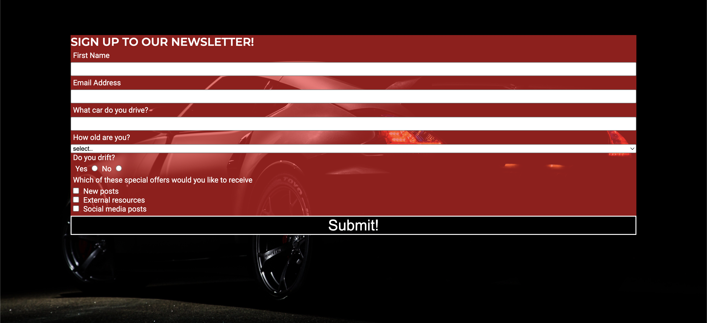

# SLIDEWAYS

## **Project Description**

Slideways is an online blog that aims to to introduce car enthusiasts to the basics of buying and modifying a drift car on a budget. The blog helps you find your car and tells you what to look out for. It also goes through beginner modifications and track safety.

## **Features**

---

### **Existing Features**

* Navigation bar
  * Seen on all 4 pages
  * Fully responsive for all device sizes.
  * Underline is shown on currently active page
  * Using a hover pseudo class underline is temporarily displayed while mouse is hovered over page selection

* Home page
  * Stylish image
  * Introduces reader to what the blog offers

* Car page
  * Contains information for reader on what requirements you need for a drift car
  * Reccomendation of a beginner-friendly budget drift car with an image of the car

* Mods page
  * Talks about necessary modifications to get a drift car track-ready
  * Pictures showing each different modification
  * Guide to track safety regulations

* Newsletter sign-up
  * Stylish background-image
  * Responsive form
  * Radio buttons for single choice option
  * Checkboxes for multiple choice options
  * Required sections
  * Button changes on hover
  * Formdump

* Footer
  * Social media links (open on new page)
  * Newsletter navigation option (internal link)

* Error 404 page
  * Error page for 'page cannot be found'

