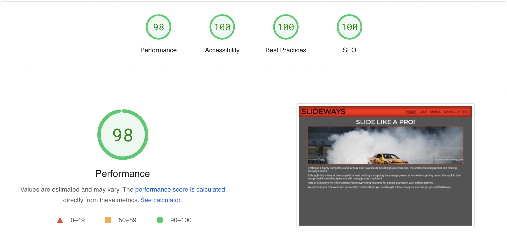

# SLIDEWAYS

- [SLIDEWAYS](#slideways)
  - [**Project Description**](#project-description)
  - [**Features**](#features)
    - [**Existing Features**](#existing-features)
  - [**Design**](#design)
    - [**Fonts**](#fonts)
    - [**Colors**](#colors)
    - [**Icons**](#icons)
  - [**Testing**](#testing)
  - [**Validation**](#validation)
  - [**Bugs**](#bugs)
    - [**Discovered Bugs**](#discovered-bugs)
  - [**Deployment**](#deployment)
  - [**Credits**](#credits)
  - [**Contact**](#contact)

---

## **Project Description**

---

Slideways is an online blog that aims to to introduce car enthusiasts to the basics of buying and modifying a drift car on a budget. The blog helps you find your car and tells you what to look out for. It also goes through beginner modifications and track safety.

---

## **Features**

---

### **Existing Features**

- Navigation bar
  - Seen on all 4 pages
  - Fully responsive for all device sizes
  - Underline is shown on currently active page
  - Using a hover pseudo class underline is temporarily displayed while mouse is hovered over page selection

- Home page
  - Stylish image
  - Introduces reader to what the blog offers

- Car page
  - Contains information for reader on what requirements you need for a drift car
  - Reccomendation of a beginner-friendly budget drift car with an image of the car

- Mods page
  - Talks about necessary modifications to get a drift car track-ready
  - Pictures showing each different modification
  - Guide to track safety regulations

- Newsletter sign-up
  - Stylish background-image
  - Responsive form
  - Radio buttons for single choice option
  - Checkboxes for multiple choice options
  - Required sections
  - Button changes on hover
  - Formdump

- Footer
  - Social media links (open on new page)
  - Newsletter navigation option (internal link)

- Error 404 page
  - Error page for 'page cannot be found'

---

## **Design**

---

### **Fonts**

- I used google fonts to import 2 fonts. These were *Montserrat* which I used for headings and *roboto* which I used for main body content. These fonts were used to compliment the blogs simplistic design.

### **Colors**

- I used <https://coolors.co/> to create my color palette.

- Primary Color
  - CMYK Red (#EC090C)
  - I used this red to symbolise the danger and thrill of drifting

- Secondary Color
  - Davy's Grey (#545454)
  - Davy's Grey is a lighter grey with a very subtle hint of green. I used this cool color as a secondary to contrast the warmer primary

- Primary Accent Color
  - Black (#000000)

- Secondary Accent Color
  - White (#FFFFFF)

### **Icons**

- I used icons from fontawesome for the social media links in the footer to give the website a more modern look

---

## **Testing**

---

I began testing after deploying the website. From here I made sure all my images loaded and fixed a couple broken file paths

I then proceeded to test my internal links to make sure they didn't open externally

From here I did the same with my external links and made sure they opened a new tab

After this I made sure my form was working correctly and required sections were mandatory

To finish up I made sure my website was fully responsive and all my elements displayed as I intended them to on all device sizes

---

## **Validation**

---

- HTML validated using <https://validator.w3.org/>
  - No mistakes were found
- CSS validated using <https://jigsaw.w3.org/css-validator/>
  - No mistakes were found
- Contrast validated using <https://webaim.org/>
  - Normal text validated at WCAG AA standard
  - Large text validated at WCAG AAA standard
  - Graphical Objects and User Interface Components validated at WCAG AA standard
- Page performance validated using <https://pagespeed.web.dev/>
  - Results were as follows

---

## **Bugs**

---

### **Discovered Bugs**

- Broken file paths to images on deployed site
  - Fixed by changing absolute file paths to relative

---

## **Deployment**

---

The website was deployed by pushing to Github and using the pages feature and can be viewed at <https://22kszov.github.io/slideways-drift-ci/index.html>

- Deployment instructions
  - Navigate to the repository
  - Select 'Actions' from the side navigation menu
  - Select the most recent 'pages build and deployment' option
  - From the workflow tree click the link under the 'deploy' heading

---

## **Credits**

---

- Favicon generated with favicon.io
- All images sourced from pexels.com
- All images compressed using image.compressor.com
- All fonts sourced from fonts.google.com
- Icons sourced from fontawesome.com
- Color palette created using coolors.co
- Markdown Table of Contents generated using the Auto Markdown TOC extension

---

## **Contact**

---

For any queries and information you can contact me at my email address 22kszov@gmail.com
